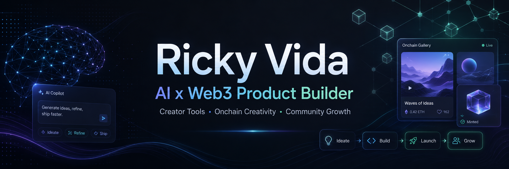

<!-- Header -->

  

<!-- Introduction -->

  <h1>Hi, I am Ricky Vida</h1>
  <h3>AI x Web3 Product Builder</h3>
  

    Exploring creator tools, onchain creativity, community growth, and AI-assisted product prototyping.
  

  
  
  

<!-- Positioning -->

  <h2>About Me</h2>

I am a Digital Media Technology student focused on the intersection of **AI tools, Web3 products, creator workflows, and community growth**.

I am not positioning myself as a pure software engineer. My strength is using AI tools to quickly turn product ideas into working demos, explain complex crypto or AI workflows in user-friendly language, and support product, content, and community operations.

Currently interested in remote opportunities around **AI x Web3**, **creator economy**, **community operations**, **product operations**, and **early-stage product prototyping**.

<!-- GitHub Snake hidden until the output branch is generated by GitHub Actions. -->

<!-- Focus Areas -->

  <h2>Focus Areas</h2>

  

    
    
    
    
  

  

    AI-assisted prototyping · Prompt workflows · Web3 product demos · NFT / IPFS concepts · Creator tools · Content operations · Community storytelling
  

<!-- Tools -->

  <h2>Creation & Product Toolkit</h2>

  <h4>AI Workflow</h4>
  

    
    
    
    
  

  <h4>Content & Visual Creation</h4>
  

    
    
    
    
    
  

  <h4>Product & Community</h4>
  

    
    
    
    
  

<!-- Projects Section -->

  <h2>Featured Projects</h2>

  <table>
    <tr>
      <td align="center" width="33%">
        <h3>Digital Ownership Platform</h3>
        
Web3 product demo for creator content, NFT metadata, IPFS storage, and onchain ownership workflows.

        

          
          
          
        

        <a href="https://github.com/Beat1ngHeart/digital-ownership-platform"><b>View Repository</b></a>
      </td>
      <td align="center" width="33%">
        <h3>AI Video Agent Demo</h3>
        
AI creator tool prototype for scripts, storyboards, digital human configuration, and batch content production.

        

          
          
          
        

        <a href="https://github.com/Beat1ngHeart/ai-video-agent-demo"><b>View Repository</b></a>
      </td>
      <td align="center" width="33%">
        <h3>Prompt Integrator</h3>
        
Structured prompt generator with mind map visualization for clearer AI workflows and product thinking.

        

          
          
          
        

        <a href="https://github.com/Beat1ngHeart/prompt-integrator"><b>View Repository</b></a>
      </td>
    </tr>
  </table>

<!-- Looking For -->

  <h2>Open To</h2>

  

    Web3 Product Operations · Web3 Community Operations · AI x Web3 Product Assistant · Creator Economy Operations · Content / Growth / Ecosystem Roles
  

<!-- Social Media -->

  <h2>Connect</h2>

  
  

<!-- Profile Snapshot -->

  <h2>Profile Snapshot</h2>

  

    
    
    
  

  

    Building small, useful demos around AI tools, Web3 product ideas, creator workflows, and community growth.
  

<!-- Footer -->

  
Building small, useful demos at the intersection of AI, Web3, and creator workflows.

